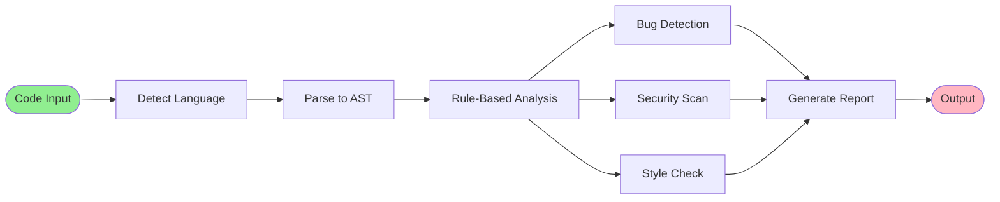

# AI-Powered Code Review Assistant - Process Flow

## Simple Process Flow Diagram


---

## Detailed Flow (Without AI)



---

## Detailed Flow (With AI)


---

## Complete System Flow


---

## Step-by-Step Process

1. **Input**: User submits code file
2. **Parse**: Detect language and parse to AST
3. **Analyze**: Run bug, security, and style checks
4. **Enhance**: AI adds context and explanations (optional)
5. **Report**: Generate formatted report
6. **Output**: Display results to user

---

## Key Components


---

## System Architecture Diagram


---

## Layered Architecture

```mermaid
graph TD
    subgraph "Layer 1: Interface"
        L1[CLI / Web / IDE]
    end
    
    subgraph "Layer 2: Orchestration"
        L2[Analysis Orchestrator]
    end
    
    subgraph "Layer 3: Parsing"
        L3[Language Parser<br/>Python | JavaScript | Java]
    end
    
    subgraph "Layer 4: Analysis"
        L4A[Bug Detector]
        L4B[Security Scanner]
        L4C[Style Checker]
    end
    
    subgraph "Layer 5: AI Enhancement"
        L5[AI Service Optional]
    end
    
    subgraph "Layer 6: Output"
        L6A[Educational Engine]
        L6B[Report Generator]
    end
    
    L1 --> L2
    L2 --> L3
    L3 --> L4A
    L3 --> L4B
    L3 --> L4C
    L4A --> L5
    L4B --> L5
    L4C --> L5
    L5 --> L6A
    L4A --> L6A
    L4B --> L6A
    L4C --> L6A
    L6A --> L6B
    L6B --> L1
    
    style L5 fill:#FFD700
    style L6B fill:#90EE90
```

---

## Component Interaction


---

## Data Flow Architecture


