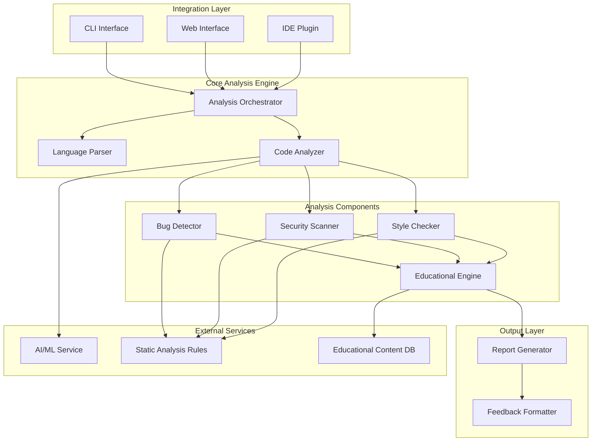

# Design Document: AI-Powered Code Review Assistant

## Overview

The AI-powered Code Review Assistant is a comprehensive tool designed to analyze source code, detect issues, and provide educational feedback to developers. The system employs a modular architecture with specialized components for different types of analysis, making it both extensible and maintainable.

The core design philosophy emphasizes:
- **Educational Focus**: Every piece of feedback includes learning context
- **Hackathon Feasibility**: Simple, implementable architecture using existing tools and libraries
- **Multi-language Support**: Extensible parser system for different programming languages
- **Integration Flexibility**: Multiple interfaces (CLI, web, IDE) sharing the same core engine

## Architecture

The system follows a layered architecture with clear separation of concerns:



### Key Architectural Decisions

1. **Modular Component Design**: Each analysis type (bugs, security, style) is a separate component, allowing for independent development and testing
2. **Pluggable Parser System**: Language-specific parsers can be added without modifying core logic
3. **Hybrid Analysis Approach**: Combines rule-based static analysis with AI-powered insights
4. **Educational-First Reporting**: All components feed into an educational engine that enriches findings with learning context

## Components and Interfaces

### Analysis Orchestrator

**Purpose**: Coordinates the entire analysis workflow and manages component interactions.

**Key Responsibilities**:
- Receives code input from integration interfaces
- Determines appropriate language parser
- Coordinates analysis components
- Manages analysis pipeline flow
- Handles error propagation and recovery

**Interface**:
```python
class AnalysisOrchestrator:
    def analyze_code(self, code: str, language: str, config: AnalysisConfig) -> AnalysisResult
    def analyze_file(self, file_path: str, config: AnalysisConfig) -> AnalysisResult
    def analyze_batch(self, file_paths: List[str], config: AnalysisConfig) -> BatchAnalysisResult
```

### Language Parser

**Purpose**: Parses source code into Abstract Syntax Trees (AST) for different programming languages.

**Supported Languages**:
- Python: Uses `ast` module for parsing
- JavaScript: Uses `esprima` or `@babel/parser`
- Java: Uses `javalang` or ANTLR-based parser

**Interface**:
```python
class LanguageParser:
    def detect_language(self, code: str, filename: str) -> str
    def parse(self, code: str, language: str) -> ParseResult
    def get_supported_languages(self) -> List[str]
```

### Bug Detector

**Purpose**: Identifies potential bugs, logical errors, and code smells using static analysis rules.

**Detection Categories**:
- Null pointer/reference issues
- Infinite loop patterns
- Unreachable code
- Type mismatches
- Resource leaks
- Logic errors

**Interface**:
```python
class BugDetector:
    def detect_bugs(self, ast: AST, code: str) -> List[BugFinding]
    def get_bug_rules(self, language: str) -> List[BugRule]
    def configure_rules(self, config: BugDetectionConfig) -> None
```

### Security Scanner

**Purpose**: Identifies security vulnerabilities and insecure coding practices.

**Security Checks**:
- SQL injection vulnerabilities
- Cross-site scripting (XSS) risks
- Hardcoded credentials
- Insecure cryptographic practices
- Path traversal vulnerabilities
- Input validation issues

**Interface**:
```python
class SecurityScanner:
    def scan_security(self, ast: AST, code: str) -> List[SecurityFinding]
    def get_security_rules(self, language: str) -> List[SecurityRule]
    def assess_severity(self, finding: SecurityFinding) -> SeverityLevel
```

### Style Checker

**Purpose**: Validates code style, formatting, and adherence to best practices.

**Style Checks**:
- Naming conventions
- Indentation and formatting
- Function/method complexity
- Documentation requirements
- Code organization patterns

**Interface**:
```python
class StyleChecker:
    def check_style(self, ast: AST, code: str) -> List[StyleFinding]
    def apply_style_guide(self, style_guide: StyleGuide) -> None
    def get_style_suggestions(self, finding: StyleFinding) -> List[Suggestion]
```

### Educational Engine

**Purpose**: Enriches analysis findings with educational context, explanations, and learning resources.

**Educational Features**:
- Detailed explanations for each finding
- Before/after code examples
- Links to relevant documentation
- Best practice recommendations
- Learning path suggestions

**Interface**:
```python
class EducationalEngine:
    def enrich_finding(self, finding: Finding) -> EducationalFinding
    def generate_explanation(self, finding_type: str, context: dict) -> Explanation
    def get_learning_resources(self, topic: str) -> List[Resource]
```

### Report Generator

**Purpose**: Formats analysis results into comprehensive, actionable reports.

**Report Features**:
- Structured findings with priorities
- Code quality metrics
- Progress tracking
- Export formats (JSON, HTML, Markdown)

**Interface**:
```python
class ReportGenerator:
    def generate_report(self, findings: List[Finding]) -> Report
    def format_report(self, report: Report, format: str) -> str
    def calculate_metrics(self, findings: List[Finding]) -> QualityMetrics
```

## Data Models

### Core Data Structures

```python
@dataclass
class Finding:
    id: str
    type: FindingType  # BUG, SECURITY, STYLE
    severity: SeverityLevel  # CRITICAL, HIGH, MEDIUM, LOW
    line_number: int
    column_number: int
    message: str
    code_snippet: str
    suggestion: Optional[str]
    
@dataclass
class EducationalFinding(Finding):
    explanation: str
    examples: List[CodeExample]
    resources: List[Resource]
    best_practices: List[str]

@dataclass
class AnalysisResult:
    file_path: str
    language: str
    findings: List[EducationalFinding]
    metrics: QualityMetrics
    analysis_time: float
    
@dataclass
class QualityMetrics:
    total_issues: int
    critical_issues: int
    high_issues: int
    medium_issues: int
    low_issues: int
    code_quality_score: float
    maintainability_index: float
```

### Configuration Models

```python
@dataclass
class AnalysisConfig:
    enabled_checks: List[str]
    severity_threshold: SeverityLevel
    style_guide: str
    custom_rules: List[Rule]
    educational_level: str  # BEGINNER, INTERMEDIATE, ADVANCED
    
@dataclass
class IntegrationConfig:
    output_format: str
    include_examples: bool
    include_resources: bool
    max_findings_per_type: int
```

Now I need to use the prework tool to analyze the acceptance criteria before writing the Correctness Properties section.

## Correctness Properties

*A property is a characteristic or behavior that should hold true across all valid executions of a system—essentially, a formal statement about what the system should do. Properties serve as the bridge between human-readable specifications and machine-verifiable correctness guarantees.*

Based on the requirements analysis, the following properties ensure the system behaves correctly across all valid inputs:

### Property 1: Multi-language parsing capability
*For any* valid source code file in a supported language (Python, JavaScript, Java), the Code_Analyzer should successfully parse the code and produce a valid AST representation
**Validates: Requirements 1.1, 1.2, 1.3**

### Property 2: Language detection accuracy
*For any* source code file with a recognized extension or content pattern, the Language_Parser should correctly identify the programming language
**Validates: Requirements 1.5**

### Property 3: Unsupported language error handling
*For any* file with an unsupported language or invalid format, the Code_Analyzer should return a descriptive error message without crashing
**Validates: Requirements 1.4**

### Property 4: Bug detection completeness
*For any* code containing known bug patterns (null pointer risks, infinite loops, unreachable code, logical errors), the Bug_Detector should identify and flag them with accurate line numbers
**Validates: Requirements 2.1, 2.2, 2.3, 2.4**

### Property 5: Bug severity classification
*For any* detected bug, the Bug_Detector should assign an appropriate severity level (critical, high, medium, low) based on the bug type and potential impact
**Validates: Requirements 2.5**

### Property 6: Security vulnerability detection
*For any* code containing known security vulnerabilities (SQL injection, XSS, hardcoded credentials, weak crypto), the Security_Scanner should detect and flag them appropriately
**Validates: Requirements 3.1, 3.2, 3.3, 3.4**

### Property 7: Security severity assessment
*For any* detected security vulnerability, the Security_Scanner should provide an appropriate severity rating based on the vulnerability type and exploitability
**Validates: Requirements 3.5**

### Property 8: Style violation detection
*For any* code that violates style guidelines (naming conventions, indentation, complexity, documentation), the Style_Checker should identify the violations and provide specific improvement suggestions
**Validates: Requirements 4.1, 4.2, 4.3, 4.4, 4.5**

### Property 9: Educational content enrichment
*For any* detected finding (bug, security issue, or style violation), the Educational_Engine should provide explanatory content including problem explanation, benefits of fixes, and learning resources
**Validates: Requirements 5.1, 5.2, 5.3, 5.5**

### Property 10: Educational examples provision
*For any* finding that suggests code improvements, the Educational_Engine should provide concrete before/after code examples
**Validates: Requirements 5.4**

### Property 11: Report completeness and structure
*For any* completed analysis, the Report_Generator should create a structured report containing all findings with line numbers, code snippets, fix recommendations, and quality metrics
**Validates: Requirements 6.1, 6.2, 6.3, 6.5**

### Property 12: Report prioritization
*For any* analysis with multiple findings, the Report_Generator should order them by severity and impact, with critical issues appearing first
**Validates: Requirements 6.4**

### Property 13: CLI interface functionality
*For any* valid file path provided to the CLI interface, the Integration_Interface should process the file and output properly formatted results
**Validates: Requirements 7.1**

### Property 14: Batch processing efficiency
*For any* set of multiple files, the Integration_Interface should process them efficiently, utilizing parallel processing where appropriate
**Validates: Requirements 7.4**

### Property 15: Configuration file support
*For any* valid configuration file (global or project-level), the Integration_Interface should apply the specified settings correctly during analysis
**Validates: Requirements 7.5, 10.5**

### Property 16: Performance constraints
*For any* file within size limits (small < 1000 lines, medium 1000-5000 lines), the Code_Analyzer should complete analysis within the specified time constraints (10s for small, 30s for medium)
**Validates: Requirements 8.1, 8.2**

### Property 17: Parallel processing capability
*For any* batch analysis of multiple files, the Code_Analyzer should process files in parallel to improve overall throughput
**Validates: Requirements 8.4**

### Property 18: Progress reporting
*For any* long-running analysis, the Code_Analyzer should provide progress indicators to inform users of the current status
**Validates: Requirements 8.5**

### Property 19: Error handling robustness
*For any* error condition (invalid syntax, file access issues, AI failures, network problems), the system should handle it gracefully with clear error messages and appropriate fallback behavior
**Validates: Requirements 9.1, 9.2, 9.3, 9.4, 9.5**

### Property 20: Configuration rule application
*For any* custom configuration (coding standards, disabled rules, severity thresholds, language settings), the appropriate components should apply these settings correctly during analysis
**Validates: Requirements 10.1, 10.2, 10.3, 10.4**

## Error Handling

The system implements comprehensive error handling at multiple levels:

### Parser-Level Error Handling
- **Syntax Errors**: When code contains syntax errors, parsers return detailed error information including line numbers and error descriptions
- **Encoding Issues**: Files with encoding problems are handled gracefully with appropriate error messages
- **Large File Handling**: Files exceeding size limits are processed in chunks or rejected with clear messaging

### Analysis-Level Error Handling
- **AI Service Failures**: When AI analysis fails, the system falls back to rule-based static analysis
- **Rule Engine Errors**: Invalid or corrupted rules are skipped with warnings logged
- **Memory Constraints**: Analysis is throttled or simplified when memory usage approaches limits

### Integration-Level Error Handling
- **File Access Errors**: Clear messages for permission issues, missing files, or invalid paths
- **Network Failures**: Graceful degradation when external services are unavailable
- **Configuration Errors**: Validation and helpful error messages for invalid configuration files

### Recovery Strategies
- **Partial Analysis**: When some components fail, others continue to provide partial results
- **Graceful Degradation**: Core functionality remains available even when advanced features fail
- **User Notification**: Clear, actionable error messages that help users resolve issues

## Testing Strategy

The testing approach combines unit testing for specific scenarios with property-based testing for comprehensive coverage:

### Unit Testing Focus
- **Specific Examples**: Test concrete cases of bug detection, security scanning, and style checking
- **Edge Cases**: Test boundary conditions like empty files, very large files, and malformed input
- **Integration Points**: Test component interactions and data flow between modules
- **Error Conditions**: Test specific error scenarios and recovery mechanisms

### Property-Based Testing Focus
- **Universal Properties**: Verify that correctness properties hold across all valid inputs
- **Input Generation**: Use randomized code generation to test parsing and analysis robustness
- **Comprehensive Coverage**: Test with 100+ iterations per property to catch edge cases
- **Cross-Language Validation**: Ensure properties hold across all supported programming languages

### Testing Configuration
- **Minimum 100 iterations** per property test to ensure statistical confidence
- **Property test tags** reference design document properties for traceability
- **Tag format**: **Feature: ai-code-review-assistant, Property {number}: {property_text}**
- **Language-specific test suites** for each supported programming language
- **Performance benchmarks** to validate timing requirements

### Test Data Strategy
- **Synthetic Code Generation**: Generate valid and invalid code samples for comprehensive testing
- **Real-World Examples**: Include actual code samples from open-source projects
- **Vulnerability Databases**: Use known vulnerability patterns for security testing
- **Style Guide Violations**: Create systematic violations of common style guidelines

The dual testing approach ensures both correctness (property tests) and reliability (unit tests) while maintaining fast feedback cycles during development.